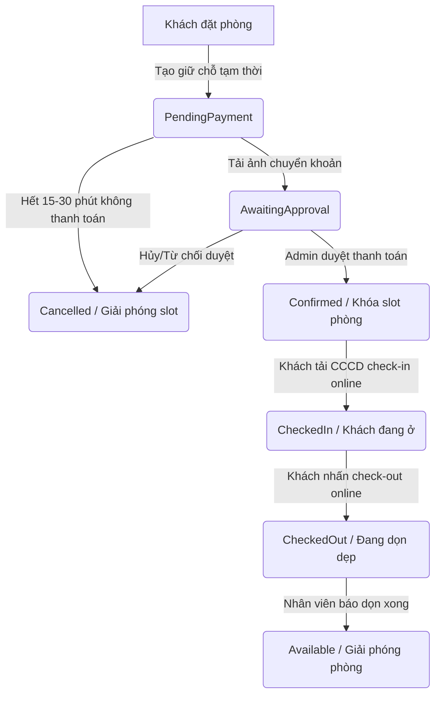

# CHƯƠNG II: PHÂN TÍCH VÀ ĐẶC TẢ YÊU CẦU

## 2.1 Tổng quan về đề tài

Đề tài **"Website đặt lịch và quản lý Homestay Self Check-in tích hợp Trí tuệ nhân tạo (AI)"** được xây dựng nhằm giải quyết các hạn chế của quy trình vận hành homestay truyền thống. Hiện nay, đa số các homestay vừa và nhỏ vẫn quản lý phòng trống thủ công qua bảng tính Excel, chốt lịch hẹn qua tin nhắn Zalo/Facebook và yêu cầu khách hàng thực hiện check-in trực tiếp tại quầy lễ tân. Quy trình này dễ dẫn đến các sai sót như đặt trùng phòng (double-booking), phản hồi thông tin chậm trễ và tốn kém nhân sự trực vận hành 24/7.

Hệ thống được thiết kế theo mô hình **Self Check-in (Tự phục vụ trực tuyến)** toàn diện, hướng tới tự động hóa toàn bộ vòng đời của một đơn đặt phòng (Booking Lifecycle). Khách hàng từ khi tìm kiếm phòng, đặt lịch theo ngày hoặc theo giờ, thực hiện thanh toán chuyển khoản, đến khi check-in nhận phòng (upload căn cước công dân) và check-out trả phòng đều có thể tự thực hiện online 100% không cần tiếp xúc vật lý.

Hệ thống bao gồm hai phân hệ chính hoạt động thống nhất trên cơ sở dữ liệu PostgreSQL dùng chung:
1. **Phân hệ Khách hàng (Public Web Portal):** Cung cấp giao diện responsive trực quan giúp khách hàng tìm kiếm phòng trống theo thời gian thực (Daily/Hourly), đặt lịch, thanh toán qua mã VietQR động, và tự check-in/out. Phân hệ tích hợp **AI Booking Chatbot** thông minh sử dụng mô hình ngôn ngữ lớn (LLM) để tư vấn phòng và hỗ trợ điền form đặt lịch tự động, cùng hệ thống **Tutorial Onboarding** dạng trò chơi hướng dẫn tương tác cho người dùng mới.
2. **Phân hệ Quản trị (Admin Panel):** Cung cấp cho người quản trị và nhân viên một bảng điều khiển trung tâm trực quan mang tên **Ma trận vận hành (Operating Matrix)** giúp cập nhật trạng thái phòng thực tế theo thời gian thực, duyệt nhanh thanh toán, check-in, check-out và đổi phòng. Phân hệ cũng tích hợp cơ chế phân quyền song song (Dual Permission Matrix - kết hợp vai trò và ghi đè tài khoản cá nhân), và **Admin AI Brain Center** quản lý tri thức (RAG & Graph Reasoning) của trợ lý ảo.

---

## 2.2 Yêu cầu chức năng

Phân hệ Khách hàng (User/Customer Flow) đáp ứng các chức năng cốt lõi sau:

### 2.2.1 Quản lý tài khoản
- **Đăng ký tài khoản:** Khách hàng mới có thể tạo tài khoản thông qua email, mật khẩu và thông tin cá nhân cơ bản. Dữ liệu tài khoản sau khi tạo được lưu trữ và gán vai trò mặc định (Customer).
- **Đăng nhập và Xác thực:** Đăng nhập hệ thống bảo mật bằng cơ chế Session-based Authentication để quản lý phiên làm việc.
- **Quản lý thông tin cá nhân (Profile):** Cho phép người dùng chỉnh sửa thông tin cá nhân, số điện thoại liên hệ, đổi mật khẩu và xem lịch sử đặt phòng của bản thân.

### 2.2.2 Tìm kiếm và Tra cứu phòng trống thời gian thực
- **Tìm kiếm nâng cao:** Lọc phòng theo Chi nhánh (Branch), Loại phòng (Room Type), khoảng giá mong muốn, sức chứa (số khách tối đa) và các tiện ích đi kèm (Wifi, Smart TV, Tủ lạnh, bồn tắm...).
- **Chế độ đặt lịch đa dạng:** Hỗ trợ cả 2 chế độ đặt chỗ:
  - **Thuê theo ngày (Daily Booking):** Chọn ngày nhận phòng (Check-in) và ngày trả phòng (Check-out).
  - **Thuê theo giờ (Hourly Booking):** Chọn ngày cụ thể và các khung giờ (slots) trống trong ngày.
- **Kiểm tra kho phòng khả dụng:** Hệ thống kết nối trực tiếp với dịch vụ `AvailabilityService` để tính toán chính xác phòng trống thực tế trong khoảng thời gian khách yêu cầu, loại bỏ hoàn toàn khả năng đặt trùng phòng.

### 2.2.3 Đặt phòng và Thanh toán (Booking & Payment)
- **Tạo đơn đặt phòng (Booking):** Sau khi chọn được phòng thích hợp, khách hàng nhập thông tin liên hệ và số lượng khách thực tế. Hệ thống sẽ tạo một đơn đặt phòng ở trạng thái tạm thời `PendingPayment`.
- **Giữ chỗ tạm thời:** Để tránh trường hợp khách hàng khác đặt trùng trong lúc chờ thanh toán, hệ thống sẽ tạm khóa các slot thời gian tương ứng. Cơ chế dịch vụ nền `BookingCleanupService` sẽ tự động giải phóng các phòng này nếu quá hạn thanh toán (15-30 phút).
- **Thanh toán qua cổng VietQR động:** Hệ thống tự động tính toán tổng tiền (`PricingService`) dựa trên đơn giá ngày/giờ, phụ thu hoặc ngày lễ, sau đó hiển thị mã QR thanh toán động chứa đầy đủ thông tin số tài khoản, số tiền và nội dung chuyển khoản tương ứng với mã đơn hàng.
- **Tải lên minh chứng thanh toán:** Người dùng tải lên ảnh chụp màn hình giao dịch chuyển khoản thành công để chuyển đơn hàng sang trạng thái chờ admin duyệt (`AwaitingApproval`).

### 2.2.4 Tự phục vụ Check-in và Check-out trực tuyến (Self Check-in/out)
- **Check-in online:** Khi đến giờ nhận phòng (đơn hàng đã được xác nhận thanh toán `Confirmed`), khách hàng truy cập hệ thống để thực hiện tự check-in bằng cách chụp/tải lên hình ảnh Căn cước công dân (CCCD). Sau khi hoàn tất, đơn hàng chuyển sang trạng thái `CheckedIn` và hệ thống hiển thị mã số phòng hoặc hướng dẫn nhận chìa khóa/mật mã số.
- **Check-out online:** Khi kết thúc thời gian lưu trú, khách hàng nhấn nút Check-out trực tuyến trên hệ thống để trả phòng, trạng thái đơn hàng cập nhật thành `CheckedOut`, đồng thời kích hoạt trạng thái phòng cần dọn dẹp để hệ thống giải phóng kho phòng cho khách hàng tiếp theo.

### 2.2.5 Trợ lý AI tư vấn đặt phòng (AI Chatbot)
- **Hội thoại tự nhiên:** Trợ lý ảo AI tích hợp tại góc màn hình trang chủ giúp giao tiếp tự nhiên với khách hàng.
- **Nhận diện ý định (Intent Extraction):** AI tự động phân tích câu chat của khách hàng để bóc tách các tham số đặt phòng (chi nhánh, ngày giờ, loại phòng, số khách...) đưa vào đối tượng quản lý trạng thái `AIBookingSessionState` lưu trong cache.
- **Tự động sinh khối giao diện động (UI Blocks):** Dựa trên tiến trình hội thoại, AI sẽ quyết định thời điểm hiển thị các thẻ phòng trống (`roomCards`), các khung giờ trống (`hourlySlots`), bảng tóm tắt đơn hàng (`bookingSummary`), hoặc mẫu điền thông tin nhanh (`bookingForm`) ngay trong khung chat để khách hàng click chốt phòng trực tiếp.

### 2.2.6 Hệ thống hướng dẫn tương tác (Tutorial Onboarding)
- **Hướng dẫn tương tác Game-like:** Hệ thống cung cấp một luồng hướng dẫn trực quan bằng các hiệu ứng bong bóng thoại chỉ dẫn từng bước như trong trò chơi điện tử khi khách hàng mới truy cập lần đầu.
- **Làm nổi bật giao diện (Highlighting):** Tự động highlight và làm mờ các vùng xung quanh của các nút chức năng cốt lõi: Thanh tìm kiếm phòng, Nút mở Chatbot AI, Nút Đặt phòng nhanh để loại bỏ sự bối bối cho khách hàng.

---

## 2.3 Yêu cầu chức năng của phân hệ quản trị

Phân hệ Quản trị (Admin controls) đáp ứng các chức năng nghiệp vụ chuyên sâu sau:

### 2.3.1 Ma trận vận hành phòng (Admin Operating Matrix)
- **Giao diện quản lý lưới trực quan:** Hiển thị toàn bộ các phòng theo dạng lưới (Matrix) phân chia theo chi nhánh và các khung thời gian thực tế.
- **Giám sát trạng thái thời gian thực:** Cập nhật ngay lập tức màu sắc đại diện cho trạng thái của từng phòng:
  - *Màu xanh lá:* Phòng trống sẵn sàng đón khách (Available).
  - *Màu vàng:* Đang chờ khách hàng thanh toán (PendingPayment).
  - *Màu cam:* Đã tải lên minh chứng thanh toán, chờ admin phê duyệt (AwaitingApproval).
  - *Màu xanh dương:* Khách đã check-in và đang lưu trú (CheckedIn).
  - *Màu đỏ:* Khách đã check-out, phòng đang chờ nhân viên dọn dẹp (CheckedOut / Cleaning).
- **Thao tác nhanh một chạm:** Cho phép admin click trực tiếp vào ô phòng để thực hiện nhanh các tác vụ: Duyệt thanh toán, Check-in thủ công, Check-out thủ công, Đổi phòng nhanh cho khách (Room Swap) khi có sự cố, Đánh dấu dọn dẹp xong để giải phóng phòng trống.

### 2.3.2 Quản lý Đặt phòng (Bookings Management)
- **Danh sách đặt phòng:** Hiển thị toàn bộ lịch sử và trạng thái đặt phòng của hệ thống, hỗ trợ tìm kiếm và lọc nâng cao theo chi nhánh, mã đặt phòng, tên khách hàng hoặc số điện thoại.
- **Chi tiết đặt phòng & Kiểm duyệt hình ảnh:** Xem thông tin chi tiết đơn hàng, đối chiếu ảnh chụp màn hình minh chứng chuyển khoản của khách, kiểm tra ảnh CCCD tự check-in để xác nhận tính hợp lệ.
- **Quản lý Thùng rác (Trash & Restore):** Hỗ trợ xóa mềm (Soft-delete) các đơn đặt phòng bị hủy/sai lệch sang trạng thái lưu trữ thùng rác, và cho phép phục hồi (Restore) khi cần thiết mà không làm mất dấu vết dữ liệu.

### 2.3.3 Quản lý danh mục hệ thống
- **Quản lý Chi nhánh (Branches):** Thêm, sửa, xóa thông tin chi nhánh (Tên, địa chỉ, bản đồ, số hotline).
- **Quản lý Loại phòng (Room Types):** Thêm, sửa, xóa danh mục loại phòng kèm giá cơ bản theo ngày/giờ, mô tả tiện nghi và số lượng khách tối đa.
- **Quản lý Phòng vật lý (Rooms):** CRUD phòng cụ thể thuộc từng chi nhánh, gán loại phòng và gán trạng thái hoạt động vật lý.
- **Quản lý Slots & Cấu hình ngày lễ (Settings & Holidays):** Cấu hình các khung giờ hoạt động cố định trong ngày, thiết lập danh sách ngày lễ tết để tự động áp dụng chính sách phụ thu giá phòng (`PricingService`).

### 2.3.4 Quản lý nhân sự và Phân quyền song song (Dual Permission Matrix)
- **Quản lý nhân viên (Staff Management):** CRUD tài khoản nhân sự quản trị, nhân viên dọn phòng, gán vai trò tương ứng (Manager, Staff, Cleaner).
- **Cấu hình ma trận quyền song song:**
  - **Mẫu quyền vai trò (Role Permission Template):** Định nghĩa sẵn danh sách các quyền hạn cho từng nhóm vai trò dưới dạng chuỗi JSON lưu trong cơ sở dữ liệu.
  - **Ghi đè quyền cá nhân (Account Override):** Cho phép admin cấp thêm hoặc tước đi cụ thể một vài quyền của một tài khoản nhân viên riêng biệt mà không cần thay đổi quyền của cả vai trò đó.
  - **Ràng buộc quyền đa cấp (Parent-Child Validation):** Các quyền con (ví dụ: `bookings.edit`, `bookings.delete`) yêu cầu tài khoản phải sở hữu quyền cha tương ứng (`bookings.view`). Hệ thống tự động ràng buộc logic này bằng Javascript ở client và kiểm tra chặt chẽ bằng `AdminAuthorizeAttribute` ở phía server.

### 2.3.5 Trung tâm quản lý AI (Admin AI Brain Center)
- **Quản lý Tri thức RAG (Knowledge Management):** CRUD các Nhóm tri thức (`ai_knowledge_collections`) và các đơn vị tri thức chi tiết (`ai_knowledge_units`), đặt độ ưu tiên (`priority`) cho từng tài liệu FAQ, nội quy phòng, hướng dẫn tiện ích để AI RAG đối sánh chuẩn xác.
- **Quản lý Đồ thị tri thức (Graph Reasoning):** Thiết lập các thực thể tri thức dưới dạng đỉnh đồ thị (`AIGraphNode`) và thiết lập mối liên kết ngữ nghĩa giữa các đỉnh dưới dạng cạnh đồ thị (`AIGraphEdge`), giúp AI suy luận ngữ cảnh sâu hơn khi người dùng hỏi các câu phức tạp.
- **Thiết lập Tác nhân AI (Agent Definitions):** Quản lý cấu hình, prompt hệ thống và cách thức hoạt động của 5 Agent thành viên (Persona, Live Snapshot, Knowledge RAG, Graph Reasoning, Safety Guard) và Final Synthesizer.
- **Giám sát Dấu vết hội thoại (AI Conversation Trace):** Ghi nhận chi tiết kết quả xử lý của từng Agent trong mỗi câu chat của khách hàng, hiển thị danh sách trace kèm thông tin prompt, raw tokens, time-taken để admin phục vụ việc gỡ lỗi (debugging) và tối ưu hóa prompt.

### 2.3.6 Thống kê và Báo cáo
- **Dashboard vĩ mô:** Biểu đồ hiển thị doanh thu theo chi nhánh, tỷ lệ lấp đầy phòng (occupancy rate), tỷ lệ đặt phòng theo giờ và theo ngày.
- **Xuất dữ liệu:** Hỗ trợ xuất danh sách giao dịch, doanh thu đặt phòng ra file Excel/CSV phục vụ công tác kế toán.

---

## 2.4 Yêu cầu phi chức năng

Hệ thống cần tuân thủ các chỉ tiêu chất lượng và yêu cầu kỹ thuật sau:

### 2.4.1 Hiệu năng và Khả năng đáp ứng (Performance & Responsiveness)
- **Thời gian tải trang:** Các trang giao diện phía khách hàng và Ma trận vận hành phía admin phải tải và render hoàn tất dưới 1.5 giây trong điều kiện mạng thông thường.
- **Xử lý bất đồng bộ (Asynchronous execution):** Toàn bộ các thao tác truy vấn cơ sở dữ liệu nặng, các tác vụ dọn dẹp nền, đặc biệt là các cuộc gọi HTTP API đến mô hình ngôn ngữ lớn (Groq API / LLM) bắt buộc phải sử dụng các từ khóa `async` / `await` trong ASP.NET Core để giải phóng luồng (threads), tránh gây treo máy chủ.
- **Tối ưu hóa tài nguyên AI:** Cache trạng thái cuộc hội thoại chat AI của khách hàng bằng `IMemoryCache` với thời gian sống (TTL) 30 phút nhằm tránh việc gửi lại toàn bộ lịch sử tin nhắn thô, giảm số lượng token tiêu thụ và tăng tốc độ phản hồi chat dưới 2 giây.

### 2.4.2 Độ tin cậy và Tính nhất quán dữ liệu (Reliability & Consistency)
- **Tính nhất quán của kho phòng:** Tuyệt đối không xảy ra hiện tượng đặt trùng lặp (double-booking). Mọi yêu cầu giữ chỗ tạm thời và đặt phòng chính thức phải được kiểm tra qua `AvailabilityService` bằng các truy vấn transaction an toàn trên PostgreSQL database.
- **Dọn dẹp tự động (Automated Cleanup):** Dịch vụ nền `BookingCleanupService` phải khởi chạy dưới dạng một `IHostedService` hoạt động độc lập mỗi phút một lần để quét và giải phóng các phòng bị giữ chỗ quá hạn thanh toán, hoàn trả lại slot trống cho hệ thống.
- **Khả năng tự phục hồi (Resilience):** Hệ thống kết nối cơ sở dữ liệu qua EF Core cần được cấu hình cơ chế tự động thử lại (Retry on failure) để xử lý các sự cố mất kết nối cơ sở dữ liệu PostgreSQL tạm thời.

### 2.4.3 Bảo mật và An toàn thông tin (Security & Privacy)
- **Bảo mật phân quyền phía Server:** Mọi endpoint thuộc phân hệ quản trị phải được kiểm tra thông qua bộ lọc `AdminAuthorizeAttribute` trước khi thực thi code.
- **Mã hóa dữ liệu:** Thông tin mật khẩu người dùng và nhân viên phải được băm (hash) bằng thuật toán an toàn trước khi lưu xuống PostgreSQL.
- **Quyền riêng tư dữ liệu CCCD:** Các file hình ảnh CCCD tự check-in của khách hàng phải được lưu trữ trong thư mục riêng biệt bảo mật, chỉ các tài khoản quản trị có quyền `bookings.detail` mới được phân quyền đọc file hình ảnh này.
- **Safety Guard cho AI:** Trợ lý ảo AI phải tuân thủ nghiêm ngặt các quy định an toàn: không tự ý bịa giá phòng, không tự xác nhận đặt phòng thành công, và không tiết lộ mã check-in/OTP mở cửa khi chưa được hệ thống xác nhận thanh toán thành công.

### 2.4.4 Khả năng mở rộng và Tính khả dụng (Scalability & Usability)
- Giao diện người dùng phải hiển thị tốt, responsive trên mọi kích thước màn hình phổ biến (Mobile, Tablet, Desktop) dựa trên lưới Bootstrap 5.
- Cấu trúc mã nguồn phân lớp rõ ràng (Controllers - Services - Models - Data Context) giúp dễ dàng mở rộng và tích hợp thêm cổng thanh toán thật (PayOS Webhook, Momo API) hoặc hệ thống khóa cửa thông minh (Smart Lock IoT API) trong tương lai.

---

## 2.5 Phân tích nghiệp vụ tổng thể

### 2.5.1 Các thực thể nghiệp vụ cốt lõi (Core Business Entities)
Nghiệp vụ của hệ thống được xây dựng xung quanh mối quan hệ chặt chẽ giữa 3 nhóm thực thể chính:
- **Phòng vật lý (`rooms`):** Đại diện cho sản phẩm kinh doanh thực tế, thuộc một Chi nhánh và có Loại phòng cụ thể để định biên đơn giá thuê ngày/đơn giá thuê giờ.
- **Hồ sơ đặt phòng (`bookings`):** Thực thể trung tâm lưu giữ thông tin khách hàng, thời gian thuê (Check-in/Check-out), tổng tiền thanh toán, hình ảnh minh chứng thanh toán và hình ảnh định danh CCCD.
- **Tồn kho slot phòng (`room_slots`):** Đơn vị phân rã thời gian của phòng (theo ngày hoặc các block giờ). Đây là cơ sở để dịch vụ `AvailabilityService` tính toán phòng trống. Mỗi khi phát sinh đơn đặt phòng, hệ thống sẽ ánh xạ và khóa các slot tương ứng trong bảng này.

### 2.5.2 Vòng đời của một đơn đặt phòng (Booking Lifecycle)

Quy trình nghiệp vụ cốt lõi điều khiển dòng trạng thái của đơn đặt phòng diễn ra qua 5 giai đoạn nghiêm ngặt:

1. **Giữ chỗ tạm thời (`PendingPayment`):** Khách hàng chọn phòng và nhấn đặt chỗ. Hệ thống lưu đơn đặt phòng và khóa tạm các slot thời gian tương ứng. Bắt đầu đếm ngược 15-30 phút.
2. **Hủy tự động (`Cancelled`):** Nếu khách hàng không thanh toán hoặc không tải lên ảnh chuyển khoản, dịch vụ nền `BookingCleanupService` tự động chạy quét, chuyển đơn sang trạng thái `Cancelled`, đồng thời giải phóng các slot thời gian để khách hàng khác có thể tìm và đặt.
3. **Chờ duyệt thanh toán (`AwaitingApproval`):** Khách hàng thực hiện chuyển khoản và tải ảnh minh chứng lên hệ thống. Đơn hàng chuyển sang trạng thái chờ admin phê duyệt, tạm ngừng cơ chế hủy tự động.
4. **Đã xác nhận (`Confirmed`):** Admin mở Ma trận vận hành, kiểm duyệt hình ảnh chuyển khoản hợp lệ và nhấn nút Xác nhận. Đơn đặt phòng chính thức được chốt, hệ thống khóa cứng các slot phòng tương ứng.
5. **Đang lưu trú (`CheckedIn`):** Khi đến thời gian nhận phòng, khách hàng thực hiện tự check-in trực tuyến bằng cách tải lên ảnh căn cước công dân. Trạng thái phòng chuyển sang `CheckedIn`. Phòng trên Ma trận vận hành của admin chuyển sang màu xanh dương (Khách đang ở).
6. **Đã trả phòng (`CheckedOut`):** Khi hết giờ thuê hoặc khách hàng bấm nút Trả phòng trực tuyến. Trạng thái phòng chuyển sang `CheckedOut` (đại diện cho trạng thái cần dọn dẹp). Phòng trên Ma trận vận hành chuyển sang màu đỏ báo hiệu cho nhân viên dọn dẹp. Sau khi nhân viên dọn phòng hoàn tất và cập nhật trạng thái trên Ma trận, phòng được phục hồi về trạng thái trống (Available - màu xanh lá) để sẵn sàng đón lượt khách tiếp theo.

### 2.5.3 Quy trình đặt phòng qua Trợ lý ảo AI
Bên cạnh luồng đặt phòng truyền thống qua biểu mẫu điền thông tin, hệ thống cung cấp luồng đặt phòng tự động thông qua giao tiếp với trợ lý ảo AI:
1. Khách hàng nhập câu hỏi tự nhiên về nhu cầu đặt phòng.
2. Chatbot AI chuyển tin nhắn qua `AIBrainOrchestrator` để phân tích ngữ nghĩa, trích xuất dữ liệu chi nhánh, loại phòng, thời gian thuê và số khách.
3. Tác nhân `Live Snapshot Agent` gọi trực tiếp `AvailabilityService` để lấy danh sách phòng trống thực tế tại thời điểm đó trong cơ sở dữ liệu.
4. Tác nhân `Safety Guard Agent` áp các luật an toàn hệ thống (không tự ý xác nhận booking khi chưa chuyển khoản, không tự chế giá phòng).
5. Bộ tổng hợp `Final Synthesizer` kết xuất câu trả lời và kèm theo khối giao diện chọn phòng trống nhanh hoặc hiển thị biểu mẫu xác nhận thông tin đặt phòng đã được AI điền sẵn.
6. Khách hàng chỉ cần bấm nút xác nhận trên khối giao diện đó để tạo ngay đơn hàng ở trạng thái `PendingPayment` và tiếp tục quy trình thanh toán chuẩn. Quy trình này kết hợp hài hòa giữa sự linh hoạt của trí tuệ nhân tạo và tính bảo mật, chính xác của logic nghiệp vụ lập trình.
