# PROMPT VÀ MÃ NGUỒN VẼ SƠ ĐỒ PHÂN RÃ CHỨC NĂNG HỆ THỐNG

Tài liệu này cung cấp Prompt dùng để chat với AI (ChatGPT, Claude, Gemini) để vẽ Sơ đồ phân rã chức năng (Functional Decomposition Diagram) của hệ thống **WebHomestay**.

---

## DẠNG 1: PROMPT VẼ SƠ ĐỒ CHỨC NĂNG HỆ THỐNG (DALL-E / GPTs / ERASER.IO)

Bạn copy prompt dưới đây gửi cho AI để vẽ sơ đồ dạng khối phân cấp:

```text
Tạo một sơ đồ phân rã chức năng (Functional Decomposition Diagram / Hierarchy Chart) cho dự án "Website Đặt Lịch & Quản Lý Homestay Self Check-in".
- Phong cách vẽ: Dạng vẽ phẳng tối giản (flat vector style), các khối hộp hình chữ nhật góc bo tròn, viền đen dày vừa phải, nền trắng hoàn toàn. Sử dụng màu xanh dương nhạt cho phân hệ khách hàng và màu cam nhạt cho phân hệ quản trị.
- Bố cục sơ đồ dạng cây phân cấp từ trên xuống dưới (Top-down Hierarchy):

1. Khối gốc (Root node - Trên cùng):
   - Nhãn chữ: "HỆ THỐNG WEBHOMESTAY" (màu sắc nổi bật).

2. Cấp 1 (Chia làm 2 nhánh lớn đi xuống):
   - Nhánh bên trái: "Phân hệ Khách hàng (User Web)"
   - Nhánh bên phải: "Phân hệ Quản trị (Admin Panel)"

3. Cấp 2 (Các nhóm chức năng con đi xuống dưới từng nhánh):
   * Dưới nhánh "Phân hệ Khách hàng":
     - "Đăng ký & Đăng nhập"
     - "Tra cứu phòng trống (Ngày/Giờ)"
     - "Đặt phòng & Thanh toán QR"
     - "Self Check-in / Check-out" (Upload ảnh CCCD)
     - "Chatbot AI tư vấn tự động"
   
   * Dưới nhánh "Phân hệ Quản trị":
     - "Ma trận vận hành phòng (Matrix)" (Lưới cập nhật thời gian thực)
     - "Quản lý đặt phòng (Duyệt nhanh)" (Duyệt bill chuyển khoản/CCCD)
     - "CRUD danh mục" (Chi nhánh, loại phòng, phòng vật lý)
     - "Phân quyền nhân sự song song" (Quyền vai trò & Quyền ghi đè)
     - "AI Brain Center & FAQ RAG" (Cấu hình prompt, tri thức, traces log)
     - "Thống kê doanh thu & Xuất báo cáo"

- Yêu cầu: Các khối được nối với nhau bằng các đường thẳng màu đen sắc nét biểu thị tính phân cấp rõ ràng. Tất cả các nhãn chữ hiển thị đầy đủ bằng tiếng Việt, đúng chính tả, phông chữ sạch sẽ dễ đọc để chèn vào báo cáo đồ án.
```

---

## DẠNG 2: MÃ NGUỒN MERMAID.JS VẼ SƠ ĐỒ PHÂN RÃ CHỨC NĂNG (XEM TRƯỚC NHANH)

Dưới đây là mã nguồn Mermaid.js mô tả chi tiết sơ đồ phân rã chức năng để bạn kết xuất nhanh thành hình ảnh:

```mermaid
graph TD
    Root[HỆ THỐNG WEBHOMESTAY]
    
    %% Cấp 1
    User[Phân hệ Khách hàng User Web]
    Admin[Phân hệ Quản trị Admin Panel]
    
    Root --> User
    Root --> Admin
    
    %% Chức năng User
    UC1[Đăng ký & Đăng nhập]
    UC2[Tra cứu phòng trống Ngày/Giờ]
    UC3[Đặt phòng & Thanh toán QR]
    UC4[Self Check-in / Check-out]
    UC5[Chatbot AI tư vấn tự động]
    UC6[Hướng dẫn Onboarding game-like]
    
    User --> UC1
    User --> UC2
    User --> UC3
    User --> UC4
    User --> UC5
    User --> UC6
    
    %% Chức năng Admin
    AC1[Ma trận vận hành phòng Matrix]
    AC2[Quản lý đặt phòng Duyệt nhanh]
    AC3[CRUD danh mục chi nhánh, phòng]
    AC4[Phân quyền nhân sự song song]
    AC5[AI Brain Center & FAQ RAG]
    AC6[Thống kê doanh thu & Xuất báo cáo]
    
    Admin --> AC1
    Admin --> AC2
    Admin --> AC3
    Admin --> AC4
    Admin --> AC5
    Admin --> AC6

    %% CSS Styling
    style Root fill:#d9e1f2,stroke:#4472c4,stroke-width:3px
    style User fill:#d5e8f0,stroke:#2e75b6,stroke-width:2px
    style Admin fill:#fce4d6,stroke:#c65911,stroke-width:2px
    
    style UC1 fill:#fff,stroke:#333
    style UC2 fill:#fff,stroke:#333
    style UC3 fill:#fff,stroke:#333
    style UC4 fill:#fff,stroke:#333
    style UC5 fill:#fff,stroke:#333
    style UC6 fill:#fff,stroke:#333
    
    style AC1 fill:#fff,stroke:#333
    style AC2 fill:#fff,stroke:#333
    style AC3 fill:#fff,stroke:#333
    style AC4 fill:#fff,stroke:#333
    style AC5 fill:#fff,stroke:#333
    style AC6 fill:#fff,stroke:#333
```


