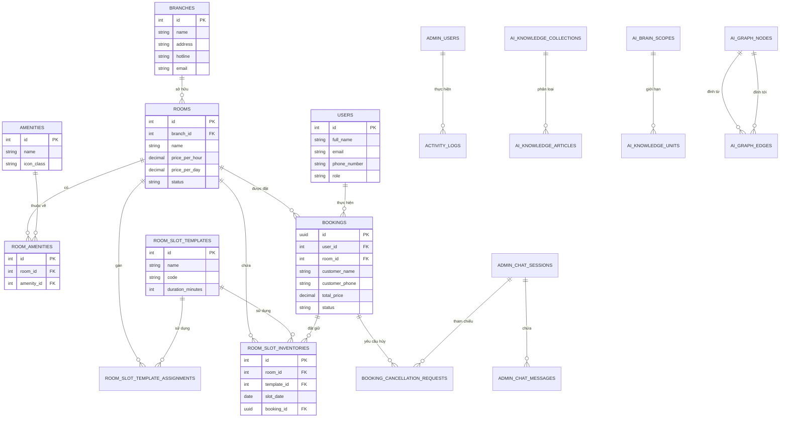
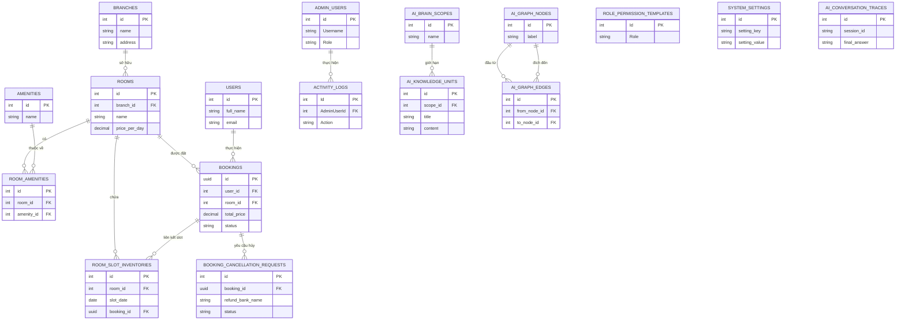

# PROMPTS VÀ MÃ NGUỒN VẼ SƠ ĐỒ THỰC THỂ CƠ SỞ DỮ LIỆU (ERD)

Tài liệu này cung cấp các Prompt dùng để chat với AI (ChatGPT, Claude, Gemini) để vẽ sơ đồ cơ sở dữ liệu (ERD) dựa theo đúng cấu trúc thực tế trong database PostgreSQL của hệ thống **WebHomestay**.

---

## DẠNG 1: PROMPT TẠO MÃ DBML CHO DBDIAGRAM.IO (VẼ SƠ ĐỒ CHUYÊN NGHIỆP - KHUYÊN DÙNG)

[dbdiagram.io](https://dbdiagram.io/) là công cụ tốt nhất hiện nay để vẽ ERD tự động giống hệt ảnh mẫu của bạn. Hãy gửi prompt sau cho AI để lấy mã DBML:

```text
Hãy tạo mã DBML (Database Markup Language) để vẽ sơ đồ ERD chi tiết cho hệ thống "WebHomestay Self Check-in" bao gồm các nhóm bảng sau:
1. Nhóm quản lý Homestay & Phòng:
   - branches (id, name, address, description, hotline, map_url, email, booking_lead_time_hours, deleted_at, is_deleted)
   - rooms (id, name, description, price_per_hour, price_per_day, extra_guest_fee, capacity, max_guests, status, image_url, branch_id, created_at, price_weekend_per_day, price_weekend_per_hour, price_holiday_per_day, price_holiday_per_hour, embedding, deleted_at, is_deleted)
   - amenities (id, name, icon_class)
   - room_amenities (id, amenity_id, room_id)
   - room_slot_templates (id, name, code, duration_minutes, cleanup_minutes, seed_start_time, fixed_start_time, fixed_end_time, crosses_midnight, is_active, deleted_at, is_deleted)
   - room_slot_template_assignments (id, room_id, template_id, effective_from, effective_to, is_active)
   - room_slot_inventories (id, room_id, template_id, slot_date, slot_label, start_time, end_time, status, booking_id)
   - room_slot_overrides (id, room_id, target_date, template_id, inventory_id, override_type, reason)

2. Nhóm Đặt phòng & Khách hàng:
   - bookings (id, user_id, room_id, customer_name, customer_phone, customer_email, customer_zalo, guest_count, id_card_front_path, id_card_back_path, customer_note, admin_note, start_time, end_time, total_price, status, payment_status, created_at, check_in_instructions, payment_proof_url, smart_lock_code, wifi_password, booking_mode, room_slot_inventory_id, slot_label)
   - booking_cancellation_requests (id, chat_session_id, booking_id, customer_name, customer_phone, status, refund_bank_name, refund_bank_account_number, refund_bank_account_holder, created_at)
   - users (id, full_name, email, password_hash, phone_number, role, created_at)

3. Nhóm Nhân sự & Phân quyền Admin:
   - admin_users (id, Username, PasswordHash, FullName, Role, BranchId, PermissionsJson, CreatedAt)
   - activity_logs (Id, AdminUserId, Action, Target, Details, Timestamp)
   - role_permission_templates (Id, Role, PermissionsJson)
   - system_settings (id, setting_key, setting_value, description, group_name)
   - holidays (id, date, description)

4. Nhóm AI RAG & Chat:
   - ai_knowledge_collections (Id, Name, Icon, Description, Order)
   - ai_knowledge_articles (Id, CollectionId, Title, Content, LastUpdated)
   - ai_knowledge_units (id, scope_id, title, content, tags, priority, is_active)
   - ai_brain_scopes (id, name, description, is_active)
   - ai_graph_nodes (id, node_type, label, summary)
   - ai_graph_edges (id, from_node_id, to_node_id, relationship_type, weight)
   - ai_conversation_traces (id, session_id, customer_message, persona_summary, live_system_snapshot, retrieved_knowledge_json, graph_reasoning_json, guard_result, final_answer)
   - admin_chat_sessions (id, session_id, customer_name, status, created_at)
   - admin_chat_messages (id, session_id, role, content, created_at)

Yêu cầu định nghĩa rõ các khóa chính (PK) và liên kết khóa ngoại (FK) giữa các bảng:
- branches.id là 1-n với rooms.branch_id
- rooms.id là 1-n với room_amenities.room_id và bookings.room_id
- amenities.id là 1-n với room_amenities.amenity_id
- room_slot_templates.id là 1-n với room_slot_inventories.template_id và room_slot_template_assignments.template_id
- users.id là 1-n với bookings.user_id
- bookings.id là 1-n với room_slot_inventories.booking_id và booking_cancellation_requests.booking_id
- admin_users.id là 1-n với activity_logs.AdminUserId
- ai_knowledge_collections.id là 1-n với ai_knowledge_articles.CollectionId
- ai_graph_nodes.id là 1-n với ai_graph_edges.from_node_id và to_node_id
- admin_chat_sessions.id là 1-n với admin_chat_messages.session_id và booking_cancellation_requests.chat_session_id
```

---

## DẠNG 2: MÃ NGUỒN MERMAID.JS ERD ĐÃ VẼ SẴN (ĐỂ XEM HOẶC CHÈN VÀO MARKDOWN)

Dưới đây là mã nguồn Mermaid.js ERD mô tả trực quan mối liên kết giữa các bảng cốt lõi trong database của bạn, giúp bạn xem trước ngay lập tức:



---

## PHẦN III: PROMPT VẼ SƠ ĐỒ ERD CHI TIẾT & ĐẦY ĐỦ HƠN (CORE GRUPED ERD - 17 BẢNG)

Để thể hiện đầy đủ hơn các tính năng đặc thù của dự án (như AI RAG/Graph, Phân quyền song song và Quản lý Slot giờ) mà không làm sơ đồ bị quá tải diện tích, bạn nên dùng sơ đồ ERD được chia thành **4 vùng chức năng** rõ ràng dưới đây với **17 bảng cốt lõi**:

### Prompt vẽ Sơ đồ ERD Phân vùng (Dành cho DALL-E / GPTs / Eraser.io)
```text
Tạo một sơ đồ cơ sở dữ liệu quan hệ thực thể (ERD Diagram) chi tiết nhưng bố cục thoáng đạt cho hệ thống "WebHomestay Self Check-in".
- Phong cách vẽ: Bản vẽ phẳng (flat draw/sketch style), nền trắng tinh khiết, nét vẽ đen mảnh rõ ràng, các khối bảng có màu tiêu đề khác nhau tùy theo phân vùng.
- Bố cục sơ đồ được chia thành 4 vùng chức năng cụ thể, mỗi bảng chỉ hiển thị các trường cốt lõi (PK, FK và các trường chính):

1. Phân vùng 1: Quản lý Homestay & Tiện nghi (Màu xanh dương nhạt):
   - "branches" (Chi nhánh): gồm id (PK), name, address, hotline.
   - "rooms" (Phòng): gồm id (PK), name, price_per_day, price_per_hour, branch_id (FK). Có đường nối từ branches.id sang rooms.branch_id.
   - "amenities" (Tiện ích): gồm id (PK), name, icon_class.
   - "room_amenities" (Tiện ích phòng): gồm id (PK), room_id (FK), amenity_id (FK). Có đường nối từ rooms và amenities chỉ vào.
   - "room_slot_inventories" (Tồn kho Slot giờ): gồm id (PK), room_id (FK), slot_date, slot_label, status, booking_id (FK). Có đường nối từ rooms chỉ vào.

2. Phân vùng 2: Khách đặt phòng & Hủy đơn (Màu xanh lá nhạt):
   - "bookings" (Đơn đặt phòng): gồm id (PK), user_id (FK), room_id (FK), total_price, status, payment_proof_url, smart_lock_code. Có đường nối từ rooms.id sang bookings.room_id.
   - "booking_cancellation_requests" (Yêu cầu hủy): gồm id (PK), booking_id (FK), refund_bank_name, refund_bank_account_number, status. Có đường nối từ bookings.id sang bảng này.
   - "users" (Tài khoản khách): gồm id (PK), full_name, email, phone_number. Có đường nối từ users.id sang bookings.user_id.

3. Phân vùng 3: Nhân sự & Phân quyền Admin (Màu cam nhạt):
   - "admin_users" (Tài khoản nhân viên): gồm id (PK), Username, FullName, Role, PermissionsJson.
   - "activity_logs" (Nhật ký hành động): gồm Id (PK), AdminUserId (FK), Action, Timestamp. Có đường nối từ admin_users.id chỉ vào.
   - "role_permission_templates" (Mẫu quyền vai trò): gồm Id (PK), Role, PermissionsJson.
   - "system_settings" (Cài đặt hệ thống): gồm id (PK), setting_key, setting_value.

4. Phân vùng 4: Công cụ Trí tuệ nhân tạo AI Brain (Màu tím nhạt):
   - "ai_knowledge_units" (Tri thức RAG): gồm id (PK), scope_id (FK), title, content, priority.
   - "ai_brain_scopes" (Phạm vi tri thức): gồm id (PK), name, is_active. Có đường nối sang ai_knowledge_units.
   - "ai_graph_nodes" (Đỉnh đồ thị AI): gồm id (PK), node_type, label, summary.
   - "ai_graph_edges" (Cạnh đồ thị AI): gồm id (PK), from_node_id (FK), to_node_id (FK), relationship_type. Có các đường nối xuất phát từ ai_graph_nodes chỉ vào.
   - "ai_conversation_traces" (Vết hội thoại): gồm id (PK), session_id, customer_message, final_answer.

- Yêu cầu đồ họa: Các đường nối chỉ rõ quan hệ khóa ngoại (FK) 1-nhiều rõ ràng. Text nhãn tiếng Việt và tiếng Anh dễ đọc, sắc nét, không bị lỗi hiển thị. Bố cục tổng thể 4 phân vùng sắp xếp đều nhau giúp sơ đồ đẹp và khoa học.
```

### Mã nguồn Mermaid.js tương thích cho Sơ đồ ERD 17 bảng


