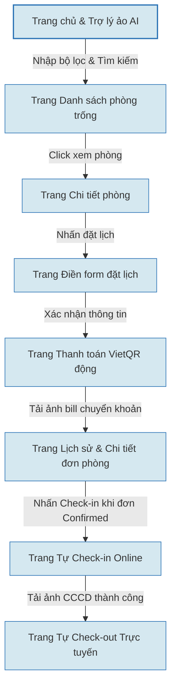
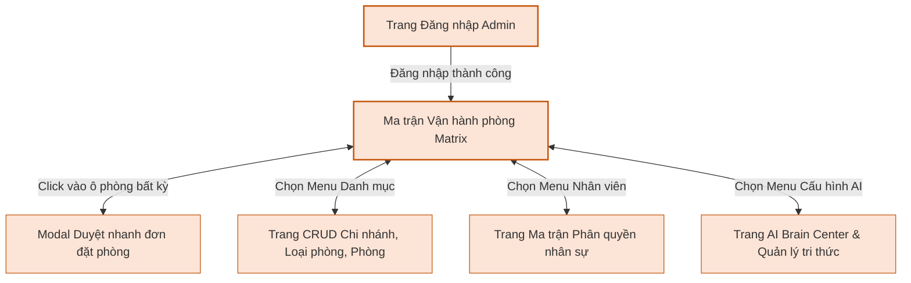

# PROMPTS VÀ MÃ VẼ SƠ ĐỒ ĐIỀU HƯỚNG CÁC TRANG WEB (USER & ADMIN FLOW)

Tài liệu này chứa **2 Prompt riêng biệt** dùng để vẽ Sơ đồ điều hướng (Sitemap / Screen Navigation Diagram) cho hai phân hệ: Khách hàng (User) và Quản trị viên (Admin) của dự án **WebHomestay**.

---

## PHẦN I: SƠ ĐỒ ĐIỀU HƯỚNG CÁC TRANG WEB USER (DÀNH CHO KHÁCH HÀNG)

### 1. Prompt vẽ ảnh sơ đồ điều hướng User (DALL-E / GPTs / Eraser.io)
```text
Tạo một sơ đồ thiết kế điều hướng luồng màn hình (Sitemap / Navigation Diagram) dành cho phân hệ Khách hàng (User Web Flow) của hệ thống "WebHomestay".
- Tiêu đề trên cùng: "Sơ đồ điều hướng trang web Khách hàng (User Flow)" (in đậm, tiếng Việt, căn giữa).
- Phong cách vẽ: Dạng vẽ phẳng tối giản (flat vector sketch), các khối màn hình hình chữ nhật bo tròn màu xanh dương nhạt, viền đen dày vừa phải, nền trắng tinh khiết, các đường mũi tên màu đen chỉ rõ hướng di chuyển.
- Các màn hình và luồng chuyển trang cụ thể bằng tiếng Việt:
  1. "Trang chủ & Trợ lý ảo AI (Home & Chatbot)" -> Khách nhập bộ lọc và nhấn Tìm kiếm -> chỉ sang:
  2. "Trang Danh sách phòng trống (Room Search Results)" -> Khách click xem phòng -> chỉ sang:
  3. "Trang Chi tiết phòng (Room Details)" -> Khách nhấn nút Đặt lịch -> chỉ sang:
  4. "Trang Điền form đặt lịch (Booking Form)" -> Khách điền thông tin và xác nhận -> chỉ sang:
  5. "Trang Thanh toán VietQR động (Payment Screen)" -> Tự sinh QR và Khách tải ảnh bill chuyển khoản -> chỉ sang:
  6. "Trang Lịch sử & Chi tiết đơn đặt phòng (Booking History)" (Hiển thị đơn hàng ở trạng thái Chờ duyệt).
  7. Từ "Trang Lịch sử đặt phòng", khi admin duyệt đơn -> Khách hàng click nút check-in -> chỉ sang:
  8. "Trang Tự Check-in Online (Self Check-in)" (Khách tải ảnh chụp CCCD).
  9. Từ "Trang Tự Check-in Online", sau khi check-in thành công -> chỉ sang:
  10. "Màn hình Trả phòng online (Check-out)".

- Yêu cầu: Các mũi tên chỉ luồng di chuyển một chiều từ bước 1 đến bước 10 rõ ràng. Chữ viết hiển thị sắc nét bằng tiếng Việt, bố cục cân đối và dễ chèn vào báo cáo.
```

### 2. Mã nguồn Mermaid.js vẽ sơ đồ điều hướng User


---

## PHẦN II: SƠ ĐỒ ĐIỀU HƯỚNG CÁC TRANG WEB ADMIN (DÀNH CHO QUẢN TRỊ VIÊN)

### 1. Prompt vẽ ảnh sơ đồ điều hướng Admin (DALL-E / GPTs / Eraser.io)
```text
Tạo một sơ đồ thiết kế điều hướng luồng màn hình (Sitemap / Navigation Diagram) dành cho phân hệ Quản trị viên (Admin Web Flow) của hệ thống "WebHomestay".
- Tiêu đề trên cùng: "Sơ đồ điều hướng trang web Admin (Admin Flow)" (in đậm, tiếng Việt, căn giữa).
- Phong cách vẽ: Dạng vẽ phẳng tối giản (flat vector sketch), các khối màn hình hình chữ nhật bo tròn màu cam nhạt, viền đen dày vừa phải, nền trắng tinh khiết, các đường mũi tên màu đen chỉ rõ hướng di chuyển.
- Bố cục chuyển trang cấu trúc cây từ trung tâm:
  1. Màn hình đầu vào: "Trang Đăng nhập Admin (Admin Login)" -> Đăng nhập thành công -> chỉ đến màn hình trung tâm:
  2. Màn hình trung tâm: "Bảng điều khiển Ma trận vận hành phòng (Matrix Dashboard)" (Nơi hiển thị lưới trạng thái phòng thời gian thực).
  3. Từ "Bảng điều khiển Ma trận vận hành phòng", chia ra 4 nhánh điều hướng bằng mũi tên 2 chiều đến các trang con:
     - Nhánh 1 (Click vào ô phòng): "Modal Duyệt nhanh đơn đặt phòng" (Duyệt chuyển khoản, check-in, check-out, đổi phòng).
     - Nhánh 2 (Chọn Menu danh mục): "Trang CRUD Danh mục" (Quản lý Chi nhánh, Loại phòng, Phòng vật lý).
     - Nhánh 3 (Chọn Menu nhân sự): "Trang Ma trận Phân quyền" (Staff permissions, phân quyền vai trò & ghi đè cá nhân).
     - Nhánh 4 (Chọn Menu cấu hình AI): "Trang Quản lý Tri thức & AI Brain Center" (Quản lý FAQ RAG, Đồ thị AI Graph, Conversation Trace).

- Yêu cầu: Thể hiện rõ cấu trúc điều hướng từ trang đăng nhập vào ma trận vận hành trung tâm và tỏa đi các trang con. Chữ viết hiển thị sắc nét bằng tiếng Việt, bố cục cân đối và sạch sẽ.
```

### 2. Mã nguồn Mermaid.js vẽ sơ đồ điều hướng Admin

