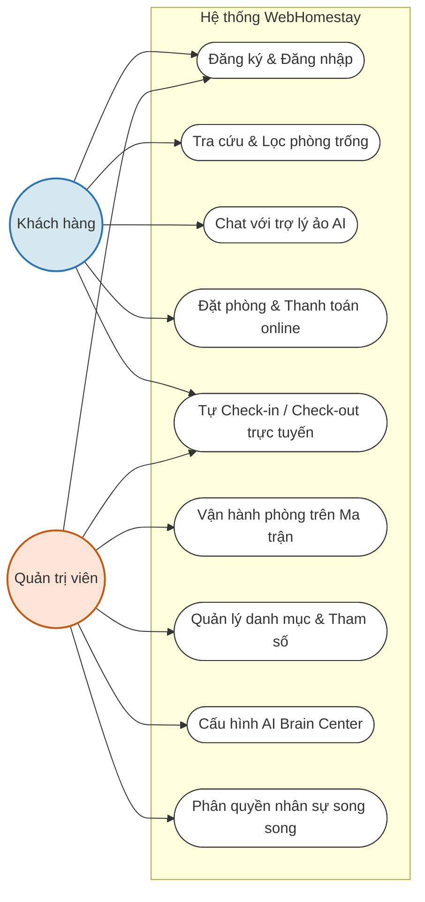
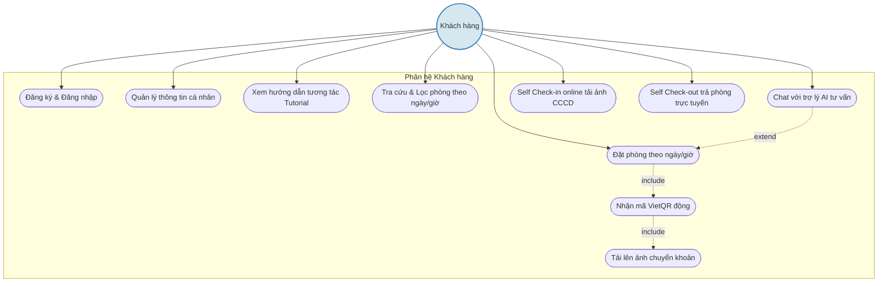
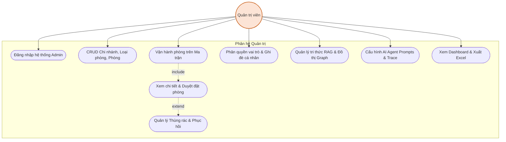

# DANH SÁCH PROMPTS VÀ MÃ NGUỒN VẼ SƠ ĐỒ USECASE (TIẾNG VIỆT)

Tài liệu này cung cấp các Prompt dùng để chat với các AI Chatbot (như Claude, ChatGPT, Gemini) để vẽ ra 3 sơ đồ Usecase cho hệ thống **Website đặt lịch và quản lý Homestay Self Check-in**.

Hỗ trợ 2 dạng:
1. **Prompt xuất mã Mermaid.js / PlantUML** (Khuyên dùng để lấy sơ đồ chuẩn kỹ thuật, dễ chỉnh sửa).
2. **Prompt cho AI vẽ ảnh trực tiếp** (Dành cho ChatGPT DALL-E hoặc các công cụ vẽ sơ đồ chuyên dụng như Eraser.io, Napkin.ai).

---

## DẠNG 1: PROMPTS ĐỂ LẤY MÃ MERMAID.JS (VẼ SƠ ĐỒ CHUẨN KỸ THUẬT)

Bạn chỉ cần sao chép các prompt dưới đây và gửi cho AI (ChatGPT/Claude/Gemini) để nó tự tạo mã Mermaid. Bạn có thể dán mã đó vào [Mermaid Live Editor](https://mermaid.live/) hoặc lưu dưới dạng file `.md` trong VS Code để xem hình ảnh trực quan.

### Prompt 1: Sơ đồ Usecase tổng quát cả hệ thống
```text
Hãy viết mã nguồn Mermaid.js để vẽ sơ đồ Usecase tổng quát (General Use Case) cho "Website đặt lịch và quản lý Homestay Self Check-in tích hợp AI".
Yêu cầu:
1. Sử dụng ngôn ngữ tiếng Việt hoàn toàn.
2. Có 2 Actor chính: "Khách hàng" (User) ở bên trái và "Quản trị viên / Nhân viên" (Admin) ở bên phải.
3. Các Usecase chung được đặt ở giữa bao gồm:
   - Đăng ký & Đăng nhập
   - Tra cứu & Lọc phòng trống
   - Chat với trợ lý ảo AI
   - Đặt phòng & Thanh toán online
   - Tự Check-in / Check-out trực tuyến
   - Quản lý danh mục & Tham số hệ thống
   - Vận hành phòng trên Ma trận (Admin Matrix)
   - Cấu hình & Vận hành AI Brain Center
   - Phân quyền nhân sự song song (Dual Matrix)
4. Hãy vẽ các liên kết (lines) nối các Actor với các Usecase tương ứng mà họ thực hiện.
5. Thiết kế kiểu hộp giới hạn hệ thống (system boundary) bao quanh các Usecase, đặt tên hệ thống là "Hệ thống WebHomestay".
6. Xuất mã Mermaid.js sạch, trực quan, dễ nhìn, định dạng dọc (top-down hoặc left-to-right).
```

### Prompt 2: Sơ đồ Usecase phân hệ Khách hàng (User)
```text
Hãy viết mã nguồn Mermaid.js để vẽ sơ đồ Usecase chi tiết cho phân hệ "Khách hàng" (User) trong hệ thống WebHomestay.
Yêu cầu:
1. Ngôn ngữ tiếng Việt.
2. Actor chính: "Khách hàng" (User).
3. Các Usecase chi tiết bao gồm:
   - Đăng ký / Đăng nhập
   - Quản lý hồ sơ cá nhân
   - Tìm kiếm & Lọc phòng (Chi nhánh, loại phòng, giá, tiện ích)
   - Đặt phòng theo ngày (Daily Booking)
   - Đặt phòng theo giờ (Hourly Booking)
   - Chat với trợ lý AI tư vấn đặt phòng
   - Quét mã VietQR động thanh toán
   - Tải lên minh chứng chuyển khoản
   - Tự Check-in trực tuyến (tải ảnh CCCD)
   - Tự Check-out trực tuyến (trả phòng)
   - Xem hướng dẫn tương tác (Tutorial Onboarding)
4. Thêm các mối quan hệ <<include>> hoặc <<extend>> phù hợp:
   - Usecase "Đặt phòng theo ngày" và "Đặt phòng theo giờ" có quan hệ <<include>> đến "Quét mã VietQR động thanh toán".
   - Usecase "Quét mã VietQR động thanh toán" có quan hệ <<include>> đến "Tải lên minh chứng chuyển khoản".
   - Usecase "Chat với trợ lý AI" có quan hệ <<extend>> đến "Đặt phòng theo ngày/giờ" (khi AI chốt lịch và tự điền biểu mẫu).
5. Đóng khung hệ thống và xuất mã Mermaid.js hiển thị đẹp, rõ ràng.
```

### Prompt 3: Sơ đồ Usecase phân hệ Quản trị (Admin)
```text
Hãy viết mã nguồn Mermaid.js để vẽ sơ đồ Usecase chi tiết cho phân hệ "Quản trị viên" (Admin / Staff) trong hệ thống WebHomestay.
Yêu cầu:
1. Ngôn ngữ tiếng Việt.
2. Actor chính: "Quản trị viên / Nhân viên" (Admin/Staff).
3. Các Usecase chi tiết bao gồm:
   - Đăng nhập hệ thống quản trị
   - Quản lý danh mục (Chi nhánh, Loại phòng, Phòng vật lý)
   - Quản lý Đặt phòng (Xem chi tiết, duyệt thanh toán, thùng rác)
   - Vận hành phòng trên Ma trận (Duyệt nhanh, Check-in/out, Đổi phòng, Dọn dẹp)
   - Phân quyền song song (Mẫu vai trò & Ghi đè cá nhân)
   - Quản lý tri thức AI (FAQ RAG & Đồ thị quan hệ Graph)
   - Cấu hình Prompt & Giám sát trace hội thoại AI
   - Xem thống kê doanh thu & Xuất báo cáo Excel
4. Thiết lập các mối quan hệ <<include>> hoặc <<extend>>:
   - Usecase "Vận hành phòng trên Ma trận" có quan hệ <<include>> đến "Quản lý Đặt phòng".
   - Usecase "Ghi đè cá nhân" và "Mẫu vai trò" là một phần hoặc có liên kết <<extend>>/<<include>> từ "Phân quyền song song".
   - Usecase "Duyệt nhanh thanh toán" trên Ma trận có quan hệ <<include>> đến "Quản lý Đặt phòng" (để đối chiếu ảnh minh chứng).
5. Đóng khung hệ thống và xuất mã Mermaid.js trực quan.
```

---

## DẠNG 2: PROMPTS CHO CÁC CÔNG CỤ VẼ ẢNH TRỰC TIẾP (DALL-E / ERASER.IO / NAPKIN.AI)

Nếu bạn muốn chat với ChatGPT (có DALL-E) hoặc các công cụ AI vẽ sơ đồ dạng vẽ tay (sketch/draw style) bằng tiếng Việt để tải về làm ảnh chèn vào Word.

### Prompt 1: Sơ đồ Usecase tổng quát cả hệ thống
```text
Tạo một sơ đồ Usecase UML tổng quát (General Use Case Diagram) cho hệ thống "WebHomestay Self Check-in".
- Style thiết kế: Định dạng nét vẽ tay dễ nhìn, tối giản, chuyên nghiệp (clean draw.io / sketch style), nền trắng hoặc sáng, các đường nối rõ ràng, không bị rối mắt.
- Bố cục:
  + Bên trái là một tác nhân (actor hình người) nhãn chữ "KHÁCH HÀNG".
  + Bên phải là một tác nhân nhãn chữ "QUẢN TRỊ VIÊN".
  + Ở giữa là một hình chữ nhật lớn đại diện cho ranh giới hệ thống ghi chữ "HỆ THỐNG WEBHOMESTAY".
  + Bên trong hình chữ nhật là các hình elip chứa chữ Tiếng Việt rõ ràng: "Đăng ký / Đăng nhập", "Tra cứu phòng trống", "Chat với AI tư vấn", "Đặt phòng & Thanh toán", "Check-in / Check-out online", "Ma trận vận hành phòng", "Quản lý danh mục", "Quản lý tri thức AI", "Phân quyền đa cấp".
- Hãy vẽ các mũi tên hoặc đường thẳng nối các tác nhân với hình elip tương ứng. Chữ tiếng Việt hiển thị rõ, đúng chính tả, không bị lỗi font chữ.
```

### Prompt 2: Sơ đồ Usecase phân hệ Khách hàng (User)
```text
Tạo sơ đồ Usecase UML chi tiết cho phân hệ "Khách hàng" (User Flow) của ứng dụng đặt phòng homestay tự động.
- Style thiết kế: Bản vẽ sketch/draw tối giản, trực quan, nền trắng sáng, bố cục khoa học, chữ tiếng Việt sắc nét.
- Tác nhân (Actor): Một hình người bên trái nhãn chữ "KHÁCH HÀNG".
- Hệ thống ranh giới: Hình hộp ghi chữ "PHÂN HỆ KHÁCH HÀNG".
- Các hình elip Usecase bên trong:
  + "Đăng nhập / Đăng ký"
  + "Lọc tìm phòng theo ngày/giờ"
  + "Chat với AI đặt phòng nhanh"
  + "Đặt phòng & Nhận QR thanh toán VietQR"
  + "Tải ảnh chuyển khoản duyệt đơn"
  + "Self Check-in online (Tải ảnh CCCD)"
  + "Self Check-out trả phòng trực tuyến"
  + "Xem hướng dẫn tương tác Tutorial"
- Vẽ các đường kết nối từ Actor "KHÁCH HÀNG" đến tất cả các Usecase. Thêm đường đứt nét biểu thị <<include>> từ "Đặt phòng" đến "Nhận QR thanh toán" và "Tải ảnh chuyển khoản".
```

### Prompt 3: Sơ đồ Usecase phân hệ Quản trị (Admin)
```text
Tạo sơ đồ Usecase UML chi tiết cho phân hệ "Quản trị viên" (Admin controls) của hệ thống quản lý homestay.
- Style thiết kế: Dạng vẽ phẳng (flat draw/sketch), màu sắc nhã nhặn chuyên nghiệp, phông chữ tiếng Việt không bị lỗi hiển thị.
- Tác nhân (Actor): Một hình người bên phải nhãn chữ "QUẢN TRỊ VIÊN".
- Hệ thống ranh giới: Hình hộp ghi chữ "HỆ THỐNG QUẢN TRỊ ADMIN".
- Các hình elip Usecase bên trong:
  + "Đăng nhập hệ thống Admin"
  + "CRUD Chi nhánh, phòng, loại phòng"
  + "Duyệt đơn đặt phòng & Xem ảnh CCCD"
  + "Vận hành phòng trên Ma trận (Đổi phòng, Check-in/out nhanh)"
  + "Phân quyền nhân sự (Quyền vai trò & Ghi đè cá nhân)"
  + "Quản lý tri thức AI RAG & Đồ thị Graph Reasoning"
  + "Cấu hình AI Agent Prompts & Giám sát trace chat"
  + "Xem doanh thu thống kê & Xuất file báo cáo"
- Vẽ các đường kết nối từ Actor "QUẢN TRỊ VIÊN" đến các Usecase elip trên. Đường nét sạch sẽ, phân bổ bố cục thoáng đạt, dễ đọc.
```

---

## DẠNG 3: MÃ NGUỒN MERMAID.JS VÀ PLANTUML ĐÃ VẼ SẴN

Nếu bạn không muốn chat thêm để lấy mã, tôi đã soạn sẵn mã nguồn Mermaid.js bên dưới. Bạn có thể chèn trực tiếp vào các file báo cáo dạng Markdown `.md` (GitHub và VS Code sẽ tự động render ra hình cực đẹp) hoặc dán vào trang web [Mermaid Live Editor](https://mermaid.live/) để xuất ra file ảnh PNG/SVG ngay lập tức.

### 1. Sơ đồ Usecase tổng quát cả hệ thống (Mermaid.js)


### 2. Sơ đồ Usecase phân hệ Khách hàng (User) (Mermaid.js)


### 3. Sơ đồ Usecase phân hệ Quản trị (Admin) (Mermaid.js)


---

---

## PHẦN IV: PROMPT VẼ SƠ ĐỒ KIẾN TRÚC HỆ THỐNG (SYSTEM ARCHITECTURE DESIGN)

Dưới đây là prompt mở rộng với **đầy đủ các thực thể hơn**, sử dụng **nhiều tiếng Việt** và tích hợp trực tiếp **LLM Groq/Gemini** theo style 3-4 tầng tương tự hình mẫu của bạn:

### Prompt vẽ Sơ đồ kiến trúc hệ thống (Dành cho DALL-E / GPTs / Whiteboard Tools)
```text
Tạo một sơ đồ thiết kế kiến trúc hệ thống (System Architecture Design) chi tiết cho "Hệ thống đặt lịch và quản lý Homestay Self Check-in tích hợp AI".
- Tiêu đề trên cùng: "Kiến trúc hệ thống WebHomestay Self Check-in" (Chữ in đậm, tiếng Việt, căn giữa).
- Phong cách thiết kế: Flat vector design, nét vẽ tay gọn gàng chuyên nghiệp (style draw.io hoặc sketch), góc bo tròn, viền đen dày vừa phải, nền trắng sáng sạch sẽ. Sử dụng màu sắc tương phản để phân biệt các tầng.
- Bố cục gồm 4 tầng chính từ trên xuống dưới với các khối nhãn tiếng Việt rõ ràng:

1. Tầng Giao diện người dùng (Client Layer - Tầng trên cùng):
   Gồm 4 khối elip/hình chữ nhật bo tròn có biểu tượng minh họa:
   - "Web Khách hàng (Client)" (icon Laptop xanh dương): Đặt lịch, chọn phòng, tải ảnh chuyển khoản.
   - "Hộp thoại AI Chatbot" (icon Bong bóng chat): Giao diện chat tư vấn, hiển thị card phòng động.
   - "Web Quản trị (Admin Matrix)" (icon Máy tính Desktop tím): Bảng lưới ma trận quản lý phòng trực quan.
   - "Hướng dẫn tương tác Tutorial" (icon Tay chơi game): Luồng Onboarding game-like highlight giao diện.
   - Các khối này có mũi tên hướng xuống Lõi Điều Phối ở tầng 2.

2. Tầng Lõi điều phối trung tâm (Controller & Routing Layer - Tầng 2):
   - Một khối hình chữ nhật lớn bao quanh, nhãn: "Lõi điều phối ASP.NET Core MVC".
   - Bên trong chứa 3 khối con quan trọng:
     + "Bộ định tuyến Request & Session" (icon Răng cưa cam)
     + "Bộ lọc Phân quyền (AdminAuthorize)" (icon Khiên bảo vệ)
     + "Bộ lưu Cache đệm (Memory Cache)" (icon Thẻ nhớ): Lưu trữ tạm thời trạng thái đặt phòng AI.
   - Từ tầng này có các đường nối chia nhánh trỏ xuống các Dịch vụ nghiệp vụ ở tầng 3.

3. Tầng Dịch vụ & Nghiệp vụ chuyên sâu (Services Layer - Tầng 3):
   Gồm 6 cột dịch vụ đứng độc lập cạnh nhau:
   - Cột 1: "Dịch vụ Đặt phòng & Tính giá" (icon Vé lịch xanh dương): Xử lý booking, tính tiền phụ thu.
   - Cột 2: "Dịch vụ Phòng trống (Availability)" (icon Chìa khóa xanh lá): Tìm kiếm phòng trống thực tế.
   - Cột 3: "Dịch vụ Quản lý Slot tồn kho" (icon Lịch tuần): Tạo slots phòng theo ngày/giờ.
   - Cột 4: "Điều phối AI (Multi-Agent Brain)" (icon Bộ não tím): Điều phối 5 Tác nhân (Persona, Live Snapshot, FAQ RAG, Graph Reasoning, Safety Guard).
   - Cột 5: "Dịch vụ Phân quyền song song" (icon Chùm khóa vàng): Hợp nhất quyền vai trò & quyền ghi đè cá nhân.
   - Cột 6: "Dịch vụ Dọn dẹp nền (Cleanup Service)" (icon Chổi quét đỏ): Tự động quét hủy booking quá hạn thanh toán.
   - Mỗi cột dịch vụ có mũi tên tương ứng chỉ xuống Tầng dữ liệu & Dịch vụ ngoài.

4. Tầng Dữ liệu & Dịch vụ ngoài (Data & External Services Layer - Tầng dưới cùng):
   - "Cơ sở dữ liệu PostgreSQL" (Biểu tượng 3 hình trụ vàng xếp chồng): Lưu trữ các bảng database thực tế như rooms (phòng), bookings (đơn đặt), room_slots (tồn kho slot), ai_knowledge_units (tri thức FAQ RAG), roles_permissions (phân quyền).
   - "Cổng tạo mã VietQR động" (icon Thẻ ngân hàng/QR): API ngoài hỗ trợ sinh QR chuyển khoản.
   - "Mô hình ngôn ngữ lớn (LLM API: Groq/Gemini)" (icon Đám mây AI): Dịch vụ trí tuệ nhân tạo nhận prompts tổng hợp và sinh câu trả lời chat tự nhiên.

- Yêu cầu đồ họa: Các đường nét kết nối rõ ràng, chữ tiếng Việt hiển thị sắc nét, không bị lỗi phông chữ hoặc méo từ. Bố cục rộng rãi, trực quan và chuyên nghiệp.
```

### Mã nguồn Mermaid.js tương ứng cho Sơ đồ kiến trúc mở rộng
```mermaid
graph TD
    %% Định nghĩa Actors/Clients
    subgraph TẦNG GIAO DIỆN & TRẢI NGHIỆM (CLIENTS)
        ClientWeb[💻 Web Khách hàng - Đặt phòng]
        ClientChat[💬 Giao diện AI Chatbot tư vấn]
        AdminMatrix[🖥️ Web Quản trị - Ma trận vận hành]
        Onboarding[🎮 Hướng dẫn tương tác Game-like]
    end

    %% Định nghĩa Lõi Controller
    subgraph TẦNG LÕI ĐIỀU PHỐI (ASP.NET CORE MVC)
        Router[⚙️ Bộ định tuyến & Session]
        Filter[🛡️ Bộ lọc Phân quyền AdminAuthorize]
        Cache[💾 Bộ lưu Cache đệm MemoryCache]
    end

    %% Định nghĩa Dịch vụ
    subgraph TẦNG DỊCH VỤ NGHIỆP VỤ (SERVICES)
        BookingService[🎟️ Dịch vụ Đặt phòng & Tính giá]
        AvailService[🔑 Dịch vụ Phòng trống Availability]
        SlotService[📅 Quản lý Slot tồn kho phòng]
        AIBrain[🧠 Điều phối AI Multi-Agent Orchestrator]
        PermService[🔑 Dịch vụ Phân quyền song song]
        CleanupService[🧹 Dịch vụ Dọn dẹp nền Cleanup]
    end

    %% Định nghĩa Data & Cổng API ngoài
    subgraph TẦNG DỮ LIỆU & DỊCH VỤ NGOÀI (DATA & EXTERNAL APIS)
        Postgres[(🗄️ CSDL PostgreSQL: Rooms, Bookings, Slots, AI Knowledge, Permissions)]
        VietQR[💳 Cổng sinh mã VietQR động]
        LLM{{☁️ Mô hình ngôn ngữ lớn LLM: Groq / Gemini API}}
    end

    %% Luồng liên kết
    ClientWeb --> Router
    ClientChat --> Router
    AdminMatrix --> Filter
    Onboarding --> Router

    Router --> BookingService
    Router --> AvailService
    Router --> SlotService
    Router --> AIBrain
    Filter --> PermService
    Router --> CleanupService

    BookingService --> Postgres
    BookingService --> VietQR
    AvailService --> Postgres
    SlotService --> Postgres
    AIBrain --> Postgres
    AIBrain --> LLM
    PermService --> Postgres
    CleanupService --> Postgres

    %% CSS Styling
    style ClientWeb fill:#d5e8f0,stroke:#2e75b6,stroke-width:2px
    style ClientChat fill:#d5e8f0,stroke:#2e75b6,stroke-width:2px
    style AdminMatrix fill:#fce4d6,stroke:#c65911,stroke-width:2px
    style Onboarding fill:#d5e8f0,stroke:#2e75b6,stroke-width:2px
    
    style Router fill:#e2f0d9,stroke:#385723,stroke-width:2px
    style Filter fill:#e2f0d9,stroke:#385723,stroke-width:2px
    style Cache fill:#e2f0d9,stroke:#385723,stroke-width:2px
    
    style AIBrain fill:#f8cbad,stroke:#c65911,stroke-width:2px
    style LLM fill:#fff2cc,stroke:#d6b656,stroke-width:2px
    style VietQR fill:#fff2cc,stroke:#d6b656,stroke-width:2px
    style Postgres fill:#fff,stroke:#333,stroke-width:2px
```


