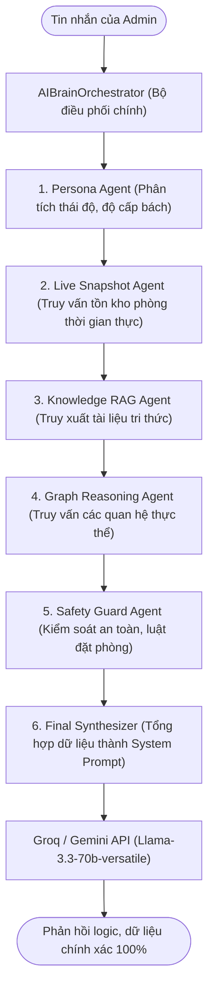

# 🏨 WebHomestay - Hệ Thống Đặt Phòng Homestay Tự Động (Self Check-in & Self Check-out)
> **Đồ Án Môn Học Công Nghệ Phần Mềm** | **Trường Đại Học Công Nghệ TP. Hồ Chi Minh (HUTECH)**

---

[](https://dotnet.microsoft.com/)
[](https://www.postgresql.org/)
[](https://learn.microsoft.com/en-us/ef/core/)
[](https://groq.com/)
[](LICENSE)

**WebHomestay** là giải pháp số hóa toàn diện quy trình vận hành và đặt phòng Homestay theo mô hình **Self Check-in & Self Check-out**. Hệ thống thay thế hoàn toàn các quy trình thủ công (trao đổi qua Zalo/tin nhắn, ghi chép sổ sách) bằng luồng tự động hóa 100%, tích hợp trợ lý ảo thông minh (AI Assistant) và giao diện Onboarding sinh động như trong game nhằm mang lại trải nghiệm tiện lợi, hiện đại và riêng tư tuyệt đối cho khách hàng.

---

## 👥 Đội Ngũ Phát Triển (Nhóm Đồ Án)

| Họ và Tên | Mã Số Sinh Viên (MSSV) | Lớp Học | Vai Trò |
| :--- | :---: | :---: | :--- |
| **Nguyễn Chí Nhân** | **2380601523** | 23DTHC3 | Trưởng nhóm, Thiết kế cơ sở dữ liệu & Backend |
| **Bùi Nguyễn Công Nghiệp** | **2380601461** | 23DTHC3 | Lập trình Frontend & Onboarding System |
| **Lưu Văn Lương** | **2380601304** | 23DTHC3 | Lập trình AI Integration & System Testing |
| **Hoàng Nhật Quân** | **2380601822** | 23DTHC3 | Phân tích nghiệp vụ (BA) & Kiểm thử |

---

## ✨ Điểm Khác Biệt & Tính Năng Cốt Lõi (USPs)

### 1. 🤖 Trợ Lý Ảo Đặt Phòng Thông Minh (Public AI Chat & Booking Conductor)
* **Tự động hóa cuộc hội thoại:** Hỗ trợ khách hàng tìm phòng, lọc phòng trống thời gian thực dựa trên nhu cầu (số khách, ngân sách, tiện ích, chi nhánh).
* **Tự động chốt phòng:** Nhận diện ý định đặt phòng và hiển thị Form đăng ký đã được điền sẵn thông tin (Public Booking Form Schema).
* **Bộ điều phối (Booking Conductor):** Sử dụng máy trạng thái lưu trữ trong Cache (`IMemoryCache`, 30 phút TTL) để theo dõi tiến trình tư vấn phòng trống của khách hàng.

### 2. 🧠 Trung Tâm Trí Tuệ Nhân Tạo Quản Trị (Admin AI Brain Center)
Hệ thống AI không chỉ là Chatbot đơn giản mà được xây dựng theo kiến trúc **Multi-Agent (Đa Tác Vụ)** kết hợp RAG & Graph Reasoning bao gồm 5 Agent xử lý tuần tự:

* **AI Tables:** `ai_knowledge_collections`, `ai_knowledge_articles`, `ai_knowledge_units`, `ai_graph_nodes`, `ai_graph_edges`, `ai_conversation_traces`... giúp admin huấn luyện tri thức phòng và vẽ bản đồ mối quan hệ bằng Graph trực quan.

### 3. 🎮 Trải Nghiệm Hướng Dẫn Tương Tác (Tutorial Onboarding)
* Thiết kế hướng dẫn tương tác trực quan như trải nghiệm tân thủ trong game.
* Highlight các khu vực chức năng quan trọng (lọc phòng, chọn giờ, điền thông tin khách hàng) giúp người dùng lần đầu truy cập hệ thống không bị bối rối.

### 4. 🔑 Ma Trận Phân Quyền Kép (Dual-Mode Permission Matrix)
* **Role-based Permission Template:** Phân quyền mặc định theo vai trò (Manager, Staff) lưu trữ dưới dạng cấu trúc JSON.
* **Account-based Override:** Cho phép đè quyền cụ thể lên từng tài khoản nhân viên.
* Hệ thống phân quyền phân rã sâu đến cấp chức năng (`{module}.{action}`): `bookings.view`, `bookings.create`, `bookings.delete`, `rooms.edit`, `ai.manage`, v.v.

### 5. 📅 Ma Trận Vận Hành & Lịch Phòng (Admin Matrix Panel)
* Quản lý đặt phòng trực quan theo trục Thời gian × Phòng (Giao diện Grid giống Excel).
* Hỗ trợ đổi phòng, kéo thả lịch đặt phòng, tự động check-in/check-out và cảnh báo dọn dẹp.

---

## 🛠️ Công Nghệ Sử Dụng (Technical Stack)

| Tầng Hệ Thống | Công Nghệ & Thư Viện | Vai trò |
| :--- | :--- | :--- |
| **Backend Core** | ASP.NET Core MVC .NET 10.0 | Kiến trúc định tuyến MVC, xử lý logic nghiệp vụ, quản lý Session. |
| **Database** | PostgreSQL | Hệ quản trị cơ sở dữ liệu quan hệ chính thức, hiệu năng cao. |
| **ORM** | Entity Framework Core & Npgsql (v8.0.0) | Kỹ thuật Code-First tự động ánh xạ Class thành bảng quan hệ PostgreSQL. |
| **Frontend** | Vanilla CSS, Bootstrap 5, jQuery | Thiết kế Responsive, xử lý DOM tương tác và Onboarding. |
| **AI LLM Engine** | Groq API (llama-3.3-70b-versatile), OpenRouter, 9router | Cung cấp dịch vụ mô hình ngôn ngữ lớn để xử lý ngôn ngữ tự nhiên. |
| **Testing** | xUnit Test Framework | Viết và chạy các kịch bản Unit Test cho domain services. |

---

## 📂 Cấu Trúc Mã Nguồn (Directory Structure)

```text
web_homestay/
├── WebHomestay/                    # Mã nguồn dự án Web chính (Backend & Frontend)
│   ├── Controllers/                # Controller điều phối luồng xử lý
│   │   ├── Admin/                  # Controller quản trị viên (Phòng, Đặt phòng, AI, Staff)
│   │   └── Public/                 # Controller phía khách hàng (Home, Rooms, Booking, AI Chat)
│   ├── Models/                     # Entity đại diện cho DB và các ViewModel
│   ├── Services/                   # Lớp nghiệp vụ chuyên sâu (Domain logic)
│   │   ├── AI/                     # Xử lý Multi-agent RAG, Graph, Embedding, Chat Conductor
│   │   └── Infrastructure/         # Quản lý Đặt phòng, Tồn kho Slot, Tính giá, Mail, DB Import
│   ├── Data/                       # DbContext cấu hình mapping PostgreSQL
│   ├── Views/                      # Giao diện Razor Pages (.cshtml)
│   ├── Filters/                    # Bộ lọc AdminAuthorize phân quyền
│   ├── wwwroot/                    # Thư mục chứa tài nguyên tĩnh (CSS, JS, Img, Uploads)
│   ├── Program.cs                  # Điểm khởi chạy cấu hình ứng dụng chính
│   └── appsettings.json            # File cấu hình kết nối DB & API Keys cục bộ
│
├── WebHomestay.Tests/              # Dự án kiểm thử tự động (Unit Tests)
│   ├── Services/                   # Kiểm thử cho Booking, Availability, Pricing
│   └── Domain/                     # Kiểm thử các logic cốt lõi
│
├── docs/                           # Tài liệu thiết kế, phân tích & Báo cáo đồ án
│   └── Báo cáo/                    # Chứa các chương báo cáo, file Word dac_ta, maubaocao
│
├── r.ps1                           # Script PowerShell quản lý (Clean, Build, Run, Watch)
└── key.md                          # File chứa API Key AI (được ignore, không commit lên GitHub)
```

---

## 🚀 Hướng Dẫn Cài Đặt & Khởi Chạy Nhanh

### 📋 Yêu Cầu Hệ Thống
* Cài đặt [.NET 10.0 SDK](https://dotnet.microsoft.com/download/dotnet/10.0).
* Cài đặt [PostgreSQL](https://www.postgresql.org/download/) & [pgAdmin 4](https://www.pgadmin.org/download/).
* Đã cấu hình và khởi chạy PostgreSQL Server cục bộ.

### 🔌 Bước 1: Cấu Hình Kết Nối Cơ Sở Dữ Liệu
Mở file `WebHomestay/appsettings.json`, chỉnh sửa chuỗi kết nối PostgreSQL phù hợp với thông tin đăng nhập PostgreSQL của bạn:
```json
"ConnectionStrings": {
  "DefaultConnection": "Host=localhost;Database=web_homestay;Username=YOUR_USERNAME;Password=YOUR_PASSWORD"
}
```

### 🔑 Bước 2: Cấu Hình API Key AI (Nếu sử dụng tính năng Chatbot)
Tạo một file tên `key.md` đặt ở thư mục gốc của dự án (ngang hàng với `WebHomestay/`) và điền API Key của Groq:
```text
gsk_xxxxYOUR_GROQ_API_KEYxxxx
```
*(Hệ thống đã được cấu hình tự động đọc file này tại `Program.cs`. File `key.md` nằm trong danh sách `.gitignore` đảm bảo không bị rò rỉ key).*

### 🛠️ Bước 3: Biên Dịch & Chạy Ứng Dụng
Hệ thống hỗ trợ script PowerShell `r.ps1` rất tiện lợi ở root directory:

1. **Khôi phục thư viện và khởi chạy hệ thống:**
   ```powershell
   .\r.ps1 up
   ```
   *Hoặc chạy trực tiếp qua dotnet CLI:*
   ```bash
   dotnet run --project WebHomestay/WebHomestay.csproj
   ```
2. **Khởi chạy chế độ tự động cập nhật code (Hot Reload):**
   ```powershell
   .\r.ps1 watch
   ```
3. **Chạy ứng dụng với Database chính thức hoặc Demo:**
   * Cơ sở dữ liệu chính: `.\wmain` (chạy script `wmain.bat`)
   * Cơ sở dữ liệu thử nghiệm: `.\wdemo` (chạy script `wdemo.bat`)

> [!NOTE]
> Hệ thống được lập trình cơ chế **Auto-Migration** khi bắt đầu chạy (`Database.Migrate()`). Khi ứng dụng khởi chạy thành công lần đầu, cấu trúc cơ sở dữ liệu PostgreSQL sẽ tự động được tạo mà bạn không cần chạy lệnh migration bằng tay.

### 🧪 Bước 4: Chạy Unit Tests
Để đảm bảo tính toàn vẹn và logic nghiệp vụ không bị lỗi:
```bash
dotnet test WebHomestay.Tests/WebHomestay.Tests.csproj
```

---

## 🔒 Bản Quyền & Giấy Phép

Dự án được phân phối dưới giấy phép **MIT License**. Chi tiết vui lòng xem tại file [LICENSE](LICENSE).

---
*Chúc các thành viên lớp **23DTHC3** bảo vệ đồ án thành công rực rỡ! 🎉*
