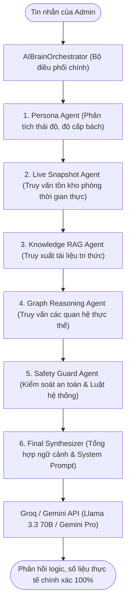

# 🏨 WebHomestay - Hệ Thống Đặt Phòng Homestay Tự Động (Self Check-in & Self Check-out)
> **Đồ Án Môn Học Công Nghệ Phần Mềm** | **Khoa Công Nghệ Thông Tin - Trường Đại Học Công Nghệ TP. Hồ Chí Minh (HUTECH)**

---

<p align="center">
  
  
  
  
  
  
</p>

---

## 🌟 Giới Thiệu Chung
**WebHomestay** là giải pháp số hóa toàn diện quy trình vận hành và đặt phòng Homestay theo mô hình **Self Check-in & Self Check-out**. Hệ thống thay thế hoàn toàn các quy trình thủ công (trao đổi qua Zalo/tin nhắn, ghi chép sổ sách phức tạp) bằng luồng tự động hóa 100%. 

Điểm nổi bật của dự án là việc tích hợp **Trợ lý ảo thông minh (AI Assistant)** ở cả cổng khách hàng & trang quản trị, kết hợp với giao diện **Onboarding tương tác sinh động** (như trong game) giúp mang lại trải nghiệm tiện lợi, hiện đại và riêng tư tuyệt đối cho khách thuê.

---

## 👥 Đội Ngũ Phát Triển (Lớp 23DTHC3)

| Họ và Tên | Mã Số Sinh Viên (MSSV) | Vai Trò & Nhiệm Vụ | Đóng Góp Chính |
| :--- | :---: | :--- | :--- |
| **Nguyễn Chí Nhân** | **2380601523** | Trưởng nhóm / Backend Developer | Thiết kế Database, xây dựng Core Services, Ma trận vận hành, Phân quyền kép & Quản lý dự án. |
| **Bùi Nguyễn Công Nghiệp** | **2380601461** | Frontend Developer | Thiết kế UI/UX Responsive, Lập trình trang chủ/phòng, xây dựng Hệ thống Tutorial Onboarding tương tác. |
| **Lưu Văn Lương** | **2380601304** | AI & Testing Engineer | Tích hợp AI Model (Groq/Gemini), thiết kế multi-agent RAG/Graph, viết kịch bản Unit Test tự động. |
| **Hoàng Nhật Quân** | **2380601822** | Business Analyst & QA | Phân tích nghiệp vụ, viết tài liệu đặc tả, kiểm thử chất lượng hệ thống và chuẩn bị dữ liệu. |

---

## ✨ Điểm Khác Biệt & Tính Năng Cốt Lõi (USPs)

### 1. 🤖 Trợ Lý Ảo Đặt Phòng (Public AI Chat & Booking Conductor)
* **Hội thoại thông minh:** Hỗ trợ khách hàng tìm phòng, lọc phòng trống thời gian thực theo chi nhánh, số khách, ngân sách và các tiện ích đi kèm.
* **Tự động chốt phòng:** Nhận diện ý định đặt phòng của khách để hiển thị ngay Form đăng ký điền sẵn thông tin tương ứng.
* **Bộ điều phối (Booking Conductor):** Sử dụng máy trạng thái (State Machine) được cache trong bộ nhớ (`IMemoryCache`, 30 phút TTL) để bám sát và dẫn dắt luồng trò chuyện của khách hàng đến bước thanh toán.
* **Tải ảnh minh chứng:** Cho phép khách hàng tải ảnh căn cước công dân (CCCD) và bill thanh toán trực tiếp trong khung chat.

### 2. 🧠 Trung Tâm Trí Tuệ Nhân Tạo Quản Trị (Admin AI Brain Center)
Hệ thống AI dành cho quản trị viên được thiết kế theo kiến trúc **Multi-Agent (Đa Tác Vụ)** kết hợp RAG và Graph Reasoning bao gồm 5 tác nhân xử lý tuần tự:



* **Dữ liệu AI chuyên sâu:** Bản đồ tri thức lưu trong database (`ai_knowledge_collections`, `ai_knowledge_articles`, `ai_graph_nodes`, `ai_graph_edges`) giúp Admin huấn luyện và vẽ sơ đồ liên kết giữa các thực thể homestay một cách trực quan.
* **Trace nhật ký:** Từng câu hỏi của Admin đều được lưu lại chi tiết đầu ra của từng Agent (`ai_conversation_traces`) phục vụ việc tối ưu hóa và gỡ lỗi prompt.

### 3. 🎮 Trải Nghiệm Hướng Dẫn Tương Tác (Tutorial Onboarding)
* Thiết kế trải nghiệm hướng dẫn từng bước (interactive guide) giống như các màn chơi tân thủ của video game.
* Tự động làm mờ và highlight các khu vực chức năng quan trọng (lọc phòng, chọn lịch thuê, điền thông tin cá nhân) giúp khách hàng lần đầu truy cập dễ dàng hoàn thành đặt phòng mà không cần đọc tài liệu hướng dẫn.

### 4. 🔑 Ma Trận Phân Quyền Kép (Dual-Mode Permission Matrix)
* **Role-based Permission Template:** Cấu hình nhóm quyền mặc định cho từng vai trò (Quản lý, Nhân viên) bằng chuỗi JSON lưu trong cơ sở dữ liệu.
* **Account-based Override:** Cho phép đè hoặc bổ sung quyền trực tiếp lên từng tài khoản nhân viên cụ thể mà không làm ảnh hưởng đến vai trò chung.
* **Phân rã sâu:** Kiểm soát chặt chẽ đến cấp độ chức năng `{module}.{action}` (ví dụ: `bookings.view`, `bookings.create`, `rooms.delete`, `ai.manage`). Kiểm tra đồng bộ từ cả Frontend (Razor Views/jQuery) cho đến bộ lọc phía Backend (`AdminAuthorizeAttribute`).

### 5. 📅 Ma Trận Vận Hành Lịch Phòng (Admin Operating Matrix)
* Quản lý đặt phòng dưới dạng lưới trực quan (Grid) trực tiếp biểu thị trục **Thời gian × Phòng**.
* Hỗ trợ kéo thả đổi phòng, tự động check-in, check-out và cảnh báo trạng thái dọn dẹp buồng phòng chỉ với một click chuột.

---

## 🛠️ Công Nghệ Sử Dụng (Technical Stack)

| Tầng Hệ Thống | Công Nghệ / Thư Viện | Mô Tả & Vai Trò |
| :--- | :--- | :--- |
| **Backend Core** | **ASP.NET Core MVC (.NET 10.0)** | Framework chính xử lý định tuyến, nghiệp vụ và Session. |
| **Database** | **PostgreSQL (v15+)** | Hệ quản trị cơ sở dữ liệu quan hệ mạnh mẽ, lưu trữ toàn bộ thông tin hệ thống. |
| **ORM** | **Entity Framework Core & Npgsql** | Ánh xạ đối tượng thành cơ sở dữ liệu theo phương pháp Code-First. |
| **Frontend UI** | **Vanilla CSS, Bootstrap 5, jQuery** | Đảm bảo giao diện hiện đại, responsive và mượt mà trên mọi thiết bị. |
| **AI Integration** | **Groq Cloud API / OpenRouter / Gemini** | Tăng tốc suy luận ngôn ngữ tự nhiên thông qua các mô hình ngôn ngữ lớn (LLM). |
| **Testing** | **xUnit, FluentAssertions, EF InMemory** | Viết các kịch bản kiểm thử tự động, cô lập cơ sở dữ liệu độc lập cho mỗi ca test. |

---

## 📂 Cấu Trúc Mã Nguồn (Directory Structure)

```text
web_homestay/
├── WebHomestay/                    # Dự án Web chính (MVC Application)
│   ├── Controllers/                # Controllers điều phối luồng dữ liệu
│   │   ├── Admin/                  # Controller quản trị (Phòng, Đặt phòng, Phân quyền, Trợ lý AI)
│   │   └── Public/                 # Controller cho khách hàng (Trang chủ, Chi tiết, Đặt phòng, Chat AI)
│   ├── Data/                       # DbContext, Cấu hình Mapping PostgreSQL và Migration
│   ├── Models/                     # Các Entities cơ sở dữ liệu và ViewModels truyền gửi dữ liệu
│   ├── Services/                   # Lớp xử lý nghiệp vụ chính (Domain Services)
│   │   ├── AI/                     # Xử lý Multi-agent RAG, Graph Reasoning và Chat Conductor
│   │   └── Infrastructure/         # Xử lý Booking, Slot Tồn kho, Tính giá, Gửi Mail, Nhập dữ liệu
│   ├── Views/                      # Razor views (.cshtml) cho giao diện quản trị và khách hàng
│   ├── Filters/                    # Bộ lọc AdminAuthorize phân quyền hệ thống
│   ├── wwwroot/                    # Thư mục tài nguyên tĩnh (CSS, JS, Hình ảnh, Tải lên)
│   ├── Program.cs                  # Khởi tạo và cấu hình các dịch vụ ứng dụng
│   └── appsettings.json            # Cấu hình kết nối Database & API Keys
│
├── WebHomestay.Tests/              # Dự án kiểm thử tự động (Unit Tests)
│   ├── Services/                   # Kiểm thử logic Booking, Tính giá, Khả dụng phòng
│   └── Domain/                     # Kiểm thử các ràng buộc nghiệp vụ lõi
│
├── docs/                           # Tài liệu thiết kế phân tích hệ thống & Báo cáo đồ án
├── r.ps1                           # Tập lệnh PowerShell tự động hóa (Build, Run, Clean, Watch)
└── key.md                          # API Key AI của hệ thống (Được ignore, không đưa lên GitHub)
```

---

## 🚀 Hướng Dẫn Cài Đặt & Khởi Chạy Nhanh

### 📋 Yêu Cầu Chuẩn Bị
* Cài đặt [.NET 10.0 SDK](https://dotnet.microsoft.com/download/dotnet/10.0).
* Cài đặt [PostgreSQL](https://www.postgresql.org/download/) và công cụ quản trị [pgAdmin 4](https://www.pgadmin.org/download/).
* Đảm bảo PostgreSQL đang chạy trên cổng mặc định `5432`.

### 🔌 Bước 1: Cấu Hình Chuỗi Kết Nối PostgreSQL
Mở file `WebHomestay/appsettings.json`, chỉnh sửa thông tin kết nối PostgreSQL phù hợp với môi trường máy của bạn:
```json
"ConnectionStrings": {
  "DefaultConnection": "Host=localhost;Port=5432;Database=web_homestay;Username=YOUR_POSTGRES_USER;Password=YOUR_POSTGRES_PASSWORD"
}
```

### 🔑 Bước 2: Thiết Lập API Key AI
Tạo một tệp tin tên `key.md` ở thư mục gốc của dự án (cùng cấp với thư mục `WebHomestay/`) và dán API Key của Groq của bạn vào đó:
```text
gsk_xxxxYOUR_GROQ_API_KEYxxxx
```
> [!IMPORTANT]
> File `key.md` đã được đưa vào `.gitignore` để đảm bảo tuyệt đối không bị lộ API Key cá nhân khi đẩy dự án lên GitHub.

### 🛠️ Bước 3: Biên Dịch & Chạy Ứng Dụng
Sử dụng script PowerShell thông minh `r.ps1` ở thư mục gốc để thao tác nhanh:

1. **Khôi phục thư viện, tạo cấu trúc DB và chạy Web:**
   ```powershell
   .\r.ps1 up
   ```
   *Hoặc sử dụng dotnet CLI thông thường:*
   ```bash
   dotnet run --project WebHomestay/WebHomestay.csproj
   ```

2. **Khởi chạy chế độ tự động theo dõi thay đổi (Hot Reload):**
   ```powershell
   .\r.ps1 watch
   ```

3. **Lựa chọn nhanh Database chạy:**
   * Sử dụng Database chính: `.\wmain` (chạy script `wmain.bat`)
   * Sử dụng Database demo thử nghiệm: `.\wdemo` (chạy script `wdemo.bat`)

> [!NOTE]
> Hệ thống được trang bị cơ chế **Auto-Migration** khi bắt đầu khởi chạy (`Database.Migrate()`). Ở lần chạy đầu tiên, toàn bộ cấu trúc bảng PostgreSQL sẽ tự động được tạo và chèn dữ liệu mẫu mà không cần chạy lệnh Migration thủ công.

### 🧪 Bước 4: Chạy Unit Tests
Kiểm tra tính đúng đắn của toàn bộ logic tính tiền phòng, chia slot và phân quyền bằng lệnh:
```bash
dotnet test WebHomestay.Tests/WebHomestay.Tests.csproj
```

---

## ⚙️ Các Lệnh Quản Trị Hệ Thống Nhanh (`.\r.ps1`)

Bộ script `r.ps1` được viết để rút gọn các dòng lệnh dài dòng trong quá trình phát triển:

| Phím tắt lệnh | Lệnh tương đương | Ý nghĩa / Chức năng |
| :---: | :--- | :--- |
| `.\r.ps1 b` | `dotnet build ...` | Biên dịch toàn bộ dự án |
| `.\r.ps1 r` | `dotnet run ...` | Khởi chạy web trên cổng localhost:5000 |
| `.\r.ps1 u` / `up` | `dotnet restore` + `build` + `run` | Cài đặt thư viện, biên dịch và chạy |
| `.\r.ps1 w` / `watch` | `dotnet watch run ...` | Chạy ứng dụng với cơ chế Hot Reload |
| `.\r.ps1 c` / `clean` | `rm -rf WebHomestay/bin ...` | Dọn dẹp các tệp tin rác phát sinh khi build |

---

## 🔒 Bản Quyền & Giấy Phép

Dự án này được cấp phép theo các điều khoản của **MIT License**. Chi tiết vui lòng tham khảo tệp tin [LICENSE](LICENSE) tại thư mục gốc.

---
<p align="center">
  Chúc các thành viên lớp <b>23DTHC3</b> bảo vệ đồ án tốt nghiệp xuất sắc và thành công rực rỡ! 🎓🎉
</p>
