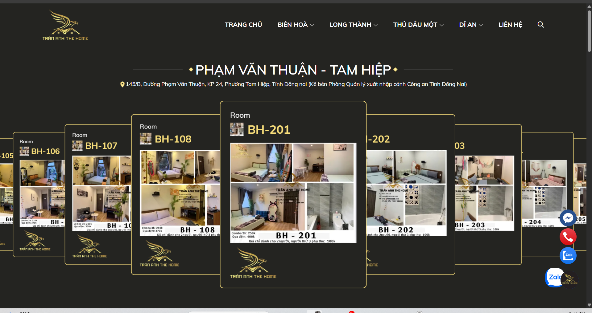
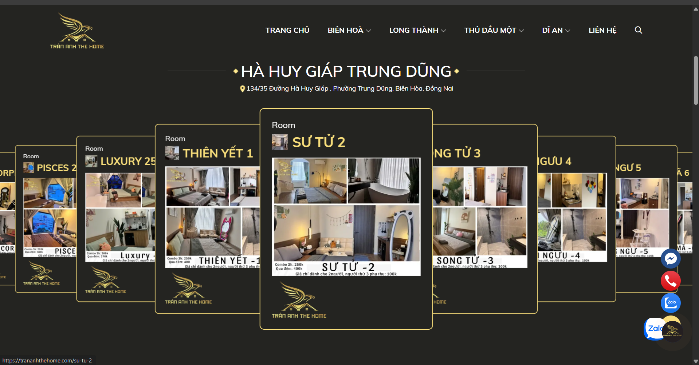
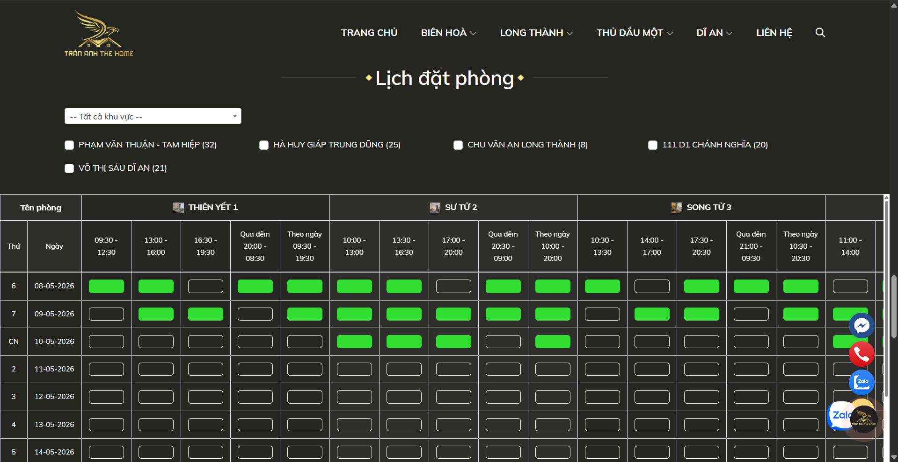

web này không cần đăng nhập/đăng ký. Chỉ lúc thanh toán mới bắt user cấp các thông tin vậy
admin vào trang quản lý  của admin bằng cách .../admin/login sẽ xuất hiện trang đăng nhập.
Khi đăng nhập xong admin có thể thêm, sửa, xóa thông tin phòng, thông tin tiện nghi.
admin có thể thêm, sửa, xóa thông tin tiện nghi. .. còn phát triển thêm. 
Admin: có 3 cấp quản trị viên : Quản trị viên cấp cao nhất: Superadmin, quản trị viên: quản lý toàn bộ, Nhân viên
Giao diện phân quyền linh hoạt "không code cứng". phần này sẽ để khi nào hoàn thiện các màn các chức năng sẽ làm ở trang admin sau
Quay lại tập trung vào trang khách hàng:
Không login/đăng ký. =>  lúc thanh toán mới bắt user cấp các thông tin

Mẫu ảnh: ,,, mang tính chất tham khảo

Trang chủ, các chi nhánh, thông tin liên hệ
Danh sách các phòng, các chi nhánh
Chi tiết phòng, chi tiết chi nhánh, tiện nghi, hình ảnh, giá cả
bảng xem khung giờ, phòng trống,...
Form đặt phòng, lấy thông tin, mã chuyển khoản,...